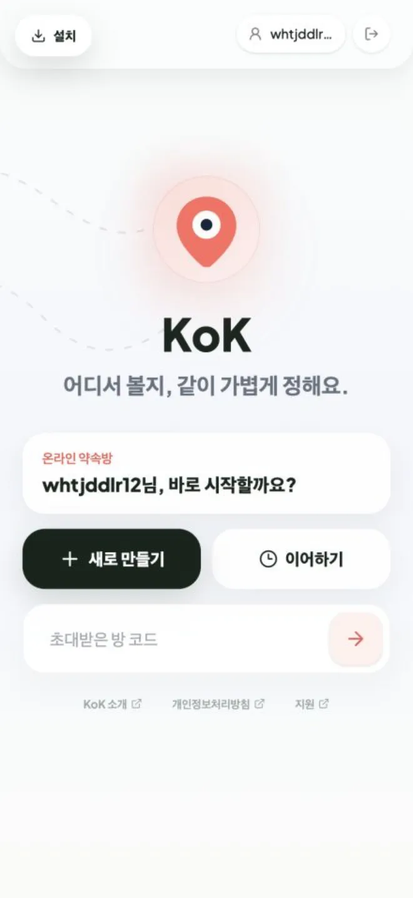
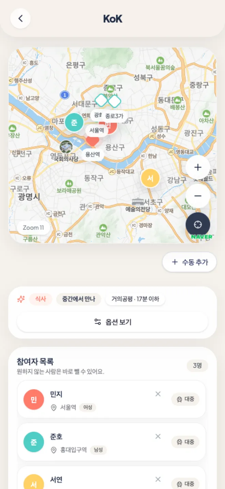
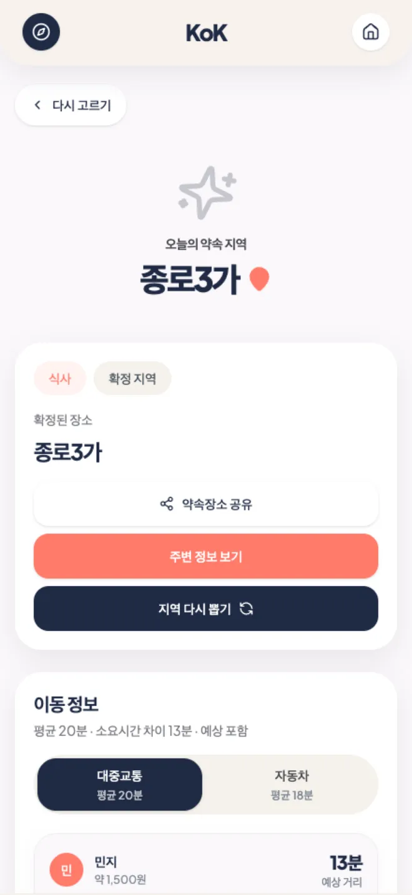

# KoK

여러 사람이 각자의 출발지를 넣으면, 모두가 이동하기 좋은 약속 장소를 찾고 공정한 랜덤 추첨으로 최종 장소를 정하는 약속 장소 추천 서비스입니다.

- 운영 주소: [https://kok-meet.vercel.app](https://kok-meet.vercel.app)
- 형태: 모바일 우선 PWA / iOS WebView 앱 대응
- 핵심 흐름: 방 만들기 -> 참가자 위치 등록 -> 후보 비교 -> 랜덤 추첨 -> 결과 공유

## 서비스 화면

<table>
  <tr>
    <td align="center">
      
      <br />
      <sub>홈</sub>
    </td>
    <td align="center">
      
      <br />
      <sub>참가자 등록</sub>
    </td>
    <td align="center">
      
      <br />
      <sub>지도 후보</sub>
    </td>
    <td align="center">
      
      <br />
      <sub>결과</sub>
    </td>
  </tr>
</table>

## 주요 기능

- 초대 코드와 링크 기반 온라인 약속방
- 로그인 사용자와 비회원 게스트 플로우
- 참가자별 출발지, 이동수단, 위치 정보 관리
- 네이버 지도 기반 주소 검색과 지도 표시
- 대중교통, 자동차 기준 이동 시간 비교
- 후보 지역 자동 추천과 AI 후보 재정렬
- 공평 기준, 핫플 기준, 근처 기준 선택
- 온라인 레디 상태 동기화
- 카드, 사다리, 돌림판 랜덤 추첨 연출
- 최종 장소 공유, 캘린더 메모, 주변 정보 추천

## 기술 스택

- Frontend: React 18, TypeScript, Vite
- Styling: Tailwind CSS, lucide-react, motion
- Backend: Vercel Serverless Functions
- Auth / Database / Realtime: Supabase
- Map / Search / Route: NAVER Maps, NAVER Local Search, NAVER Directions, ODsay
- AI: GMS AI, OpenAI, Upstage
- QA: Playwright
- Deploy: Vercel

## 프로젝트 구조

```text
api/                  Vercel API 라우트
public/               PWA manifest, service worker, 앱 아이콘
src/app/              앱 화면, 컴포넌트, 훅, 도메인 로직
src/app/components/   Home, Planner, Map, RandomDrawer, Result 등 주요 UI
src/app/hooks/        후보 검색, 이동 경로, 주변 장소 추천 훅
src/app/lib/          Supabase, 지도, AI, 약속 장소 계산 로직
src/assets/landing/   README와 랜딩 페이지용 서비스 캡처 이미지
supabase/             운영 DB 스키마와 동기화 SQL
tests/ui/             Playwright UI 회귀 테스트
```

## 로컬 실행

### 1. 의존성 설치

```bash
npm install
```

### 2. 환경변수 준비

```bash
cp .env.example .env
```

필수 값:

- `VITE_NAVER_MAP_KEY_ID`
- `VITE_SUPABASE_URL`
- `VITE_SUPABASE_PUBLISHABLE_KEY`

서버 API 기능에 필요한 값:

- `NAVER_MAP_CLIENT_SECRET`
- `NAVER_SEARCH_CLIENT_ID`
- `NAVER_SEARCH_CLIENT_SECRET`
- `ODSAY_API_KEY`
- `SUPABASE_SERVICE_ROLE_KEY`

AI 기능에 필요한 선택 값:

- `GMS_AI_API_KEY`
- `GMS_AI_MODEL`
- `GMS_AI_API_BASE_URL`
- `OPENAI_API_KEY`
- `OPENAI_MODEL`
- `UPSTAGE_API_KEY`
- `UPSTAGE_MODEL`
- `UPSTAGE_API_BASE_URL`

실제 키는 `.env`와 Vercel Environment Variables에만 저장합니다. README, 코드, 커밋에는 넣지 않습니다.

GMS AI는 OpenAI 호환 Chat Completions 엔드포인트를 사용합니다.

```env
GMS_AI_API_KEY=YOUR_GMS_AI_API_KEY
GMS_AI_MODEL=gpt-4o
GMS_AI_API_BASE_URL=https://gms.ssafy.io/gmsapi/
```

### 3. Supabase 스키마 적용

Supabase SQL Editor에서 아래 파일을 적용합니다.

```text
supabase/schema.sql
supabase/ready-vote-sync.sql
```

운영 DB에는 `meeting_rooms`, `meeting_room_participants`의 최신 컬럼이 필요합니다.

### 4. 개발 서버 실행

```bash
npm run dev
```

기본 주소는 `http://localhost:5173`입니다.

## 검증

```bash
npm run build
npm run qa:ui
```

- `npm run build`: Vite 프로덕션 빌드
- `npm run qa:ui`: 모바일/데스크톱 주요 화면 UI 회귀 테스트

## 배포

Vercel 프로젝트와 연결한 뒤 배포합니다.

```bash
vercel deploy --prod
```

현재 운영 alias는 [https://kok-meet.vercel.app](https://kok-meet.vercel.app)입니다.

## AI 호출 우선순위

서버는 설정된 환경변수와 앱 내 임시 설정에 따라 AI provider를 선택합니다.

1. 앱 내 런타임 AI 설정이 있으면 해당 provider 우선
2. `GMS_AI_API_KEY`, `GMS_AI_MODEL`, `GMS_AI_API_BASE_URL`이 모두 있으면 GMS AI
3. `OPENAI_API_KEY`가 있으면 OpenAI, 기본 모델은 `gpt-4o`
4. `UPSTAGE_API_KEY`가 있으면 Upstage, 기본 모델은 `solar-pro3`
5. AI provider가 없거나 실패하면 휴리스틱 후보 로직으로 fallback

GMS는 키만으로는 활성화되지 않습니다. 현재 GMS base URL은 `https://gms.ssafy.io/gmsapi/`, 기본 모델은 `gpt-4o`입니다. 서버는 GMS 호출 시 `/api.openai.com/v1/chat/completions` 경로를 자동으로 붙입니다.

## 운영 체크리스트

- Supabase RLS를 방 멤버, 소유자, 초대 토큰 기준으로 제한
- 참가자 위치 정보 조회/수정 권한 최소화
- AI, 지도, 교통 API 프록시에 사용자/방/IP 단위 rate limit 적용
- API 요청 크기 제한과 abuse 로그 추가
- CSP, X-Frame-Options, Referrer-Policy 등 보안 헤더 적용
- App Store 제출 전 실제 iPhone safe area, WebView, 권한 문구 확인
- Supabase 운영 스키마와 저장소 SQL 파일의 차이 정기 점검

## 개발 메모

- 온라인 추첨은 Supabase Realtime broadcast로 선택 상태를 공유합니다.
- 당첨 결과와 이동 경로는 방 상태에 저장해 참가자별 화면 차이를 줄입니다.
- 네이버 지도 SDK는 클라이언트에서 표시하고, 민감한 검색/경로 API 키는 서버 환경변수로 관리합니다.
- 긴 지명, 주차장 정보, 이동 경로 카드가 모바일 폭을 넘지 않도록 Playwright 회귀 테스트로 확인합니다.
